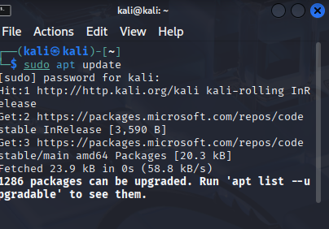
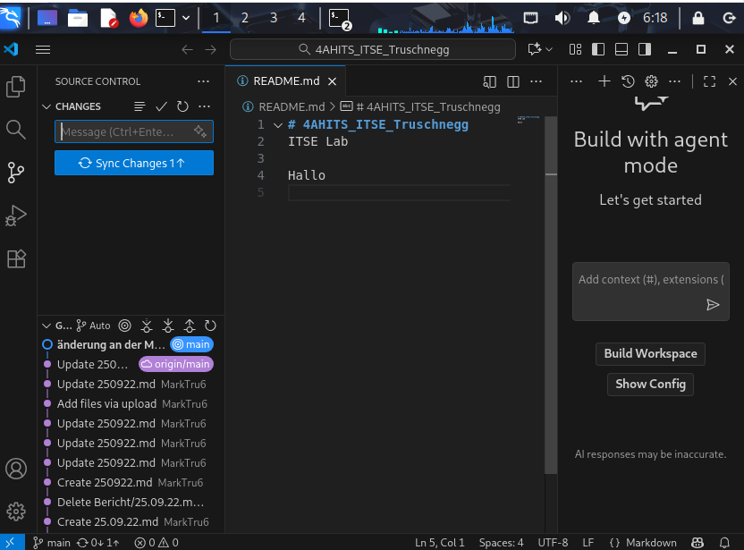

# Arbeitsbericht ITSE

---
Author: Markus ruschnegg
Klassse: 4Ahits
Fach: ITSE
Datum: 22.09.2025
---

## Kali & Metasploitable

### Bridged Mode

Auf VM klicken edit Machine und bei Network Adapter auf Bridged umstellen und bei Configure Adapter Realtek verwenden

## Visual Studio Code Installieren

 $ sudo apt update
 
 $ sudo apt install software-properties-common apt-transport-https
 
 $ wget -qO- https://packages.microsoft.com/keys/microsoft.asc | gpg --dearmor > packages.microsoft.gpg

 $ sudo install -o root -g root -m 644 packages.microsoft.gpg /etc/apt/trusted.gpg.d/

 $ sudo sh -c 'echo "deb [arch=amd64 signed-by=/etc/apt/trusted.gpg.d/packages.microsoft.gpg] https://packages.microsoft.com/repos/vscode/ stable main" > /etc/apt/sources.list.d/vscode.list'

 $ sudo apt update
 $ sudo apt install code

## Github Projekt in kali klonen

 $ git config --global user.name "MarkTru6"
 
 $ git config --global user.email "markus.truschnegg@htl-braunau.at"

 $ git clone https://github.com/MarkTru6/4AHITS_ITSE_Truschnegg
 
 $ cd 4AHITS_ITSE_Truschnegg
 
 $ code .

## Änderungen Speichern 

 $ git status
 $ git add README.md
 $ git commit -m "Änderung an der Markdown Datei: Update von Kali VM am $(date +%F)"
 $ git push origin main

Man kann auch gleich in Visual Studio Code änderungen speichern wenn man auf das verzweigte Symbol klick und dann auf den blauen knopf. Es muss oben auch eine commit massage eingegeben werden.

 

