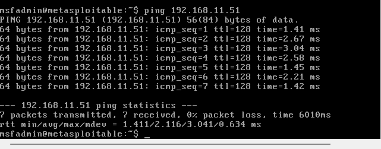
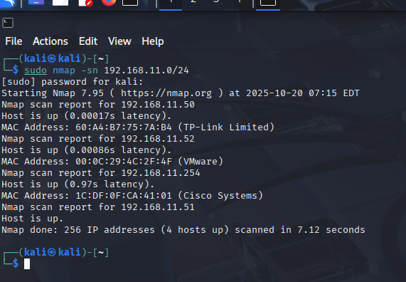

# Arbeitsbericht ITSE: Host Discovery

---

Author: Markus ruschnegg
Klassse: 4Ahits
Fach: ITSE
Datum: 20.10.2025

---

## Übung (Ping)




- 4	Benutzt IPV4, nicht verwendbar bei ping6 und default bei ping4
- 6	Benutzt IPV6, nicht verwendbar bei ping4 und default bei ping6
- c ANZAHL	ANZAHL gibt an, wie viele ping-Anfragen gesendet werden sollen, danach stoppt ping automatisch
- w ENDE	ENDE wird in Sekunden angegeben. ping wird nach dieser Zeit beendet, egal wie viele Anfragen (un-) beantwortet wurden.
- W AUSZEIT	AUSZEIT wird in Sekunden angegeben und gibt an, wie lange ping auf eine Antwort wartet, bevor es automatisch stoppt
- i INTERVALL	INTERVALL wird in Sekunden angegeben und gibt vor, in welchen Abständen die ping-Anfragen gesendet werden. Voreinstellung ist eine Sekunde.
- I SCHNITTSTELLE	legt fest, über welche Schnittstelle die ping-Anfragen gesendet werden

Ping verwendet: das ICMP-Protokoll (Internet Control Message Protocol).
Es sendet Echo Request und empfängt Echo Reply.

Firewalls:
- Viele blockieren ICMP-Echo-Requests, damit Geräte von außen nicht „angepingt“ werden können.
- Interne Netze lassen Ping oft zu, weil es zur Fehlerdiagnose wichtig ist.
- Gute Firewalls filtern gezielt oder begrenzen ICMP, statt alles zu sperren.

## Übung(Ping-Script)

```sh
#!/bin/sh
if [ -z "$1" ]; then
  echo "Benutzung: $0 <netz-base>  (z.B. 192.168.1)"
  exit 1
fi
BASE="$1"
for i in $(seq 1 254); do
  IP="$BASE.$i"
 
  OUTPUT=$(ping -c 1 -W 1 "$IP")
  if [ $? -eq 0 ]; then
    echo "$IP ist aktiv"
  fi
done

```

Übung(Host-Descovery)



### Was macht ein Nmap Ping-Scan?

Findet schnell heraus, welche IPs im Netzwerk online sind (ohne Ports zu scannen).

- wichtige Befehle

nmap -sn 192.168.1.0/24
-> Nur Host-Discovery im /24-Netz 

nmap -sn -PR 192.168.1.0/24
-> ARP-Ping

nmap -sn -PS80,443 10.0.0.0/24
-> TCP-SYN-Ping an Port 80 und 443 

nmap -Pn 203.0.113.0/24
-> Kein Ping vorher, scannt direkt Ports 

### Nützliche Optionen kurz

n -> kschneller

oG datei.gnmap -> Ausgabe zum Weiterverarbeiten

sn -> nur ping


