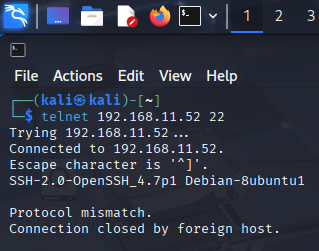
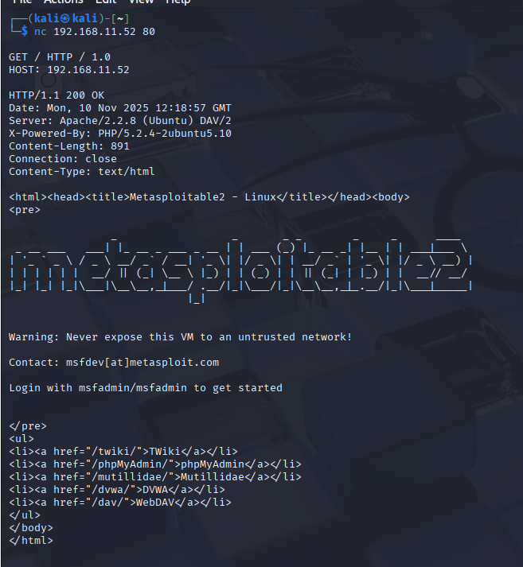
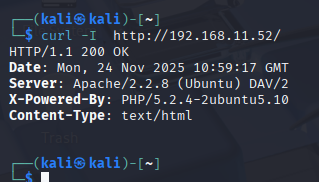
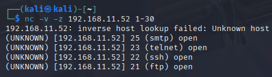
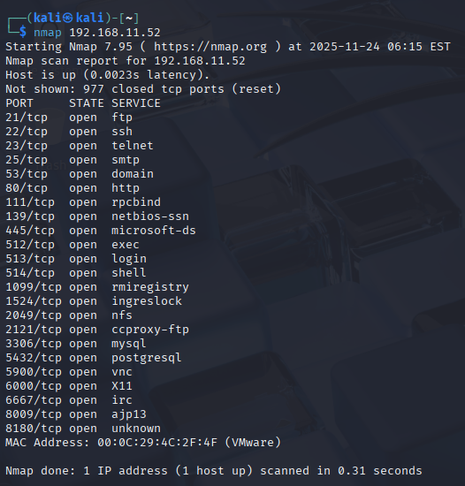
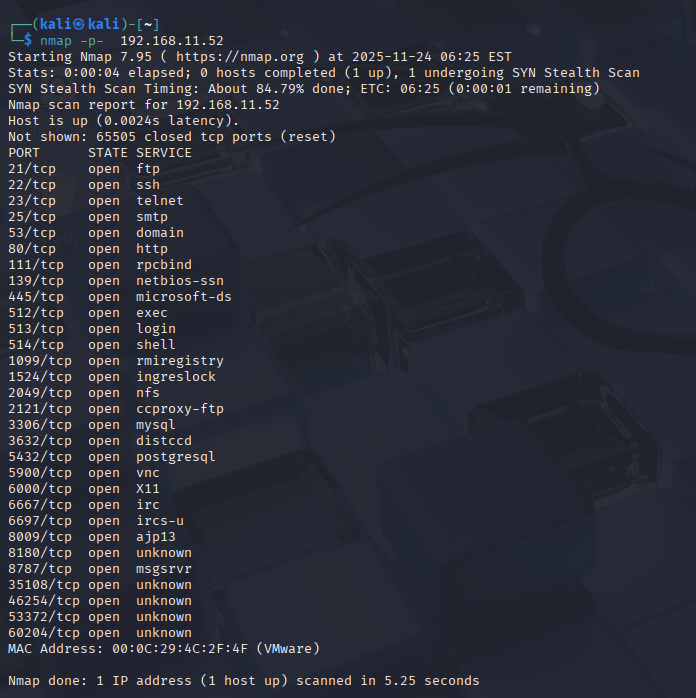

# Arbeitsbericht ITSE: Port Probing und Scanning

---

Author: Markus Truschnegg
Klassse: 4AHITS
Fach: ITSE
Datum: 10.11.2025

---

## Übung (Port Probing)

### Cheatsheet
Tool:
 - telnet: einfach auf Ports verbinden | telnet [IP] [Port]
 - nc(netcat): Port check/Banner grabbing | nc [IP] [Port]
 - curl:
     - Inhalt abrufen | curl [URL]
     - TP header anzeigen | curl -I [URL]
     - curl: Verbose (mehr Infos) | curl -V [URL]

## Übung (netcat Port Scan)

## Übung (Nmap Port Scan)

Der Standart Nmap scan scannt nur die 1000 wichtigsten Ports -p- scannt vollkommen alle Ports.
Es gibt kaum Unterschied auf Metasploitable, es kommen nur ein paar zusätzliche Ports dazu, die Hauptdienste sind schon im Standardscan sichtbar.

 
   

