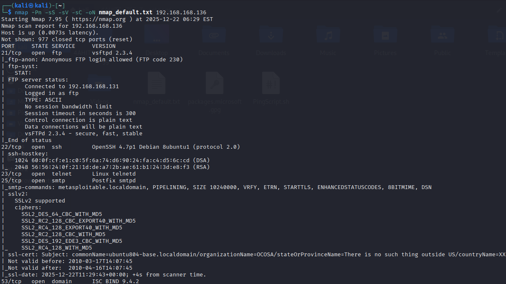
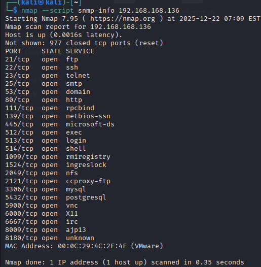
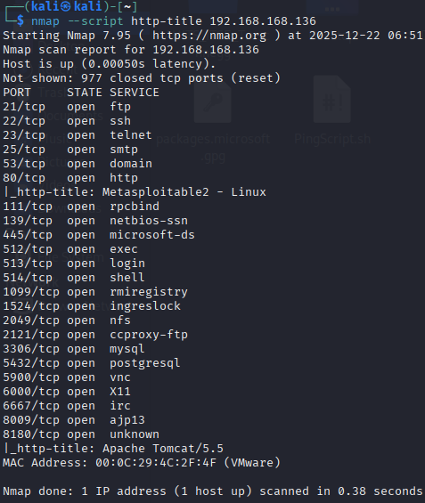

# Arbeitsbericht ITSE: Vulnerability Scan

---

Author: Markus Truschnegg

Klassse: 4AHITS

Fach: ITSE

Datum: 22.12.2025

---

## Übung (nmap enumeration)

```
nmap -Pn -sS -sV -sC -oN nmap_default.txt 10.10.92.153
```

- -Pn : Nmap scannt alle angegebenen Hosts direkt als wären sie Online
- -sS : SYN Stealth Scan
- -sV : Versucht durch zusätzliche Tests, den Dienst auf jedem offenen Port zu identifizieren
- -sC : Führt standart-Nmap-Scripts aus
- -oN : Protokolliert den Scan in einer normalen Textdatei

Was führt nmap in diesem Fall für einen besonderen Port-Scan aus?

einen TCP Syn Scan: Es wird keine Vollständige TCP-Verbindung aufgabaut

Vorteile:
  - sehr schnell
  - relativ unauffällig
  - Erkennt: offene und geschlossene Ports und gefilterte Ports

Wie viele Ports werden gescannt?

Es werden die 1000 häufigsten TCP Ports




## Übung (vulnerability scan)

### Aufgabe 1

```
nmap -sC -F 192.168.168.136
```

### Aufgabe 2

Befehle:

```
nmap --script http-title 192.168.168.136
```
```
nmap --script http-errors 192.168.168.136
```
```
nmap --script mysql-users 192.168.168.136
```
```
nmap --script mysql-info 192.168.168.136
```
```
nmap --script snmp-info 192.168.168.136
```





