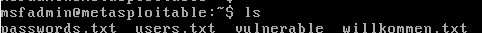
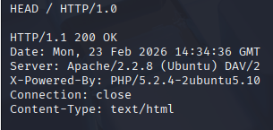
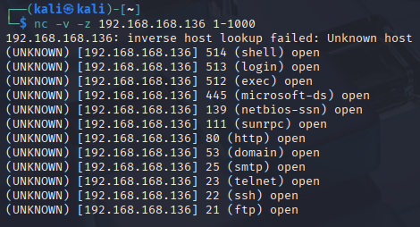

# Arbeitsbericht ITSE: 
---

Author: Markus Truschnegg

Klassse: 4AHITS

Fach: ITSE

Datum: 13.04.2026

---

## Übung (netcat chat)

listener:
```
nc -l -p <Port-Nummer>
```
```
nc <IP-Addresse listener> <Port-Nummer listener>
```


## Übung (netcat data send)

empfänger:
```
nc -l -p <Port-Nummer> > <gewünschter datei name>
```
Sender:
```
nc <IP-Addresse empfänger> <Port-Nummer empfänger> < <Datei Name>
```


## Übung (netcad banner grabbing)
```
nc <ziel IP oder URL>
HEAD / HTTP/1.0


```

### Analysiere
nach Server: steht welchen Webserver die Website verwendet

### 10 Webseiten
- orf: Apache
- 

### HTL 
Server: nginx



## Übung (netcad banner grabbingII)

```
printf "GET / HTTP/1.1\r\nHost: example.com\r\n\r\n" | nc example.com 80
```

## Übung (netcat port scanning)

```
nc -z -v <IP-Adresse> 1-1000
```


Man erfärt die Versionsnummern der unterschiedlichsten dienste


