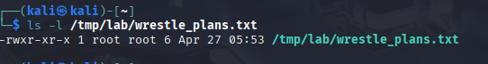
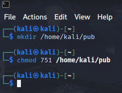

# Arbeitsbericht ITSE: Linux Permissions
---
Author: Markus Truschnegg

Klassse: 4AHITS

Fach: ITSE

Datum: 27.04.2026

---
# Vorbereitung der Übungsumgebung

Das Skrip erstellt gruppen und user mit dem passwort kali und ordnet den user gruppen zu. Und erstellt verzeichnise 

## Übung (Analyse und Symbolic Mode)

1. Rechte auslesen

   -rwxr-xr-x

   

3. Private Files
   ```
   touch notes.txt
   chmod o-r notes.txt
   ```
4. Group Sharing
   ```
   chmod u=rwx,g=rw,o= notes.txt
   ```
5. Skript Vorbereitung
   ```
   chmod ug+x myscript.sh
   ```
6. Kollektive Änderung
   ```
   chmod go-wx data.txt
   ```

## Übung (Ownership und Gruppenkollaboration)

1. Group Change
    ```
    su - blondie
    touch /temp/lab/song.txt
    chgrp music /tmp/lab/song.txt
    ```
2. Unterschied su und su -

   Bei su bleibst du im verzeichnis bei su - befindet man sich im Home verzeichnis des users 

3. User Transfer
   ```
   chown elvis /tmp/lab/song.txt
   ```
4. Wrestler szenario
   ```
   su - hogan
   touch /tmp/lab/training.txt
   chgrp wrestle /tmp/lab/training.txt
   chmod ug=rw,o= /tmp/lab/training.txt
   ```
5. Einschränkungen
   ```
   chgrp emperors <dateiname>
   ```
   Ein user kann die Gruppe der Datei nur auf eine Gruppe ändern in der er selbst Mitglied ist

## Übung (Directory Permissions und Octal Notation)

1. Octal Notation
   - rwxr-xr-x / chmod 775
   - rw-rw---- / chmod 660
   - rwx------ / chmod 700
  
2. Pub Verzeichnis
   ```
   mkdir home/kali/pub
   chmod 751 /home/kali/pub
   ```
   
3. Recursive Lockdown
   ```
   chmod -R g+rw,o-rwx /tmp/lab/drafts/
   ```
4. Search Permission
   ```
   chmod o=x /home/kali
   ```
5. Analyse

   Der Befehl chmod -R 660 /tmp/lab/ gibt user und group die rechte zum lesen und schreiben aber entzieht die berechtigung zum ausführen was man aber braucht um in ein Verzeichnis zu wechseln.
   Der Permission typ Execution fehlt x.

## Übung (Webserver Directory Permissions)
     
   
   
   


  
