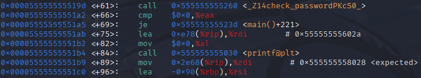
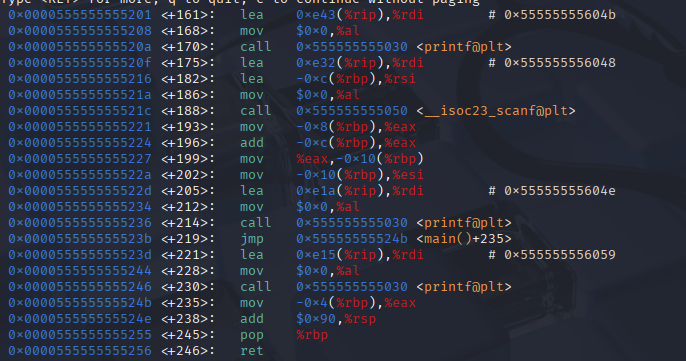
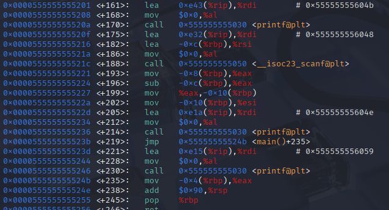

# Arbeitsbericht ITSE: Opcode Patching
---
Author: Markus Truschnegg

Klassse: 4AHITS

Fach: ITSE

Datum: 22.06.2026
---

## Übung (GNU Debugger)
Passwort umgehen:
```
breakpoint main
run
disassemble main
```


auf nop setzen:
```
set {unsigned char}0x00005555555551a5 = 0x90
set {unsigned char}0x00005555555551a6 = 0x90
set {unsigned char}0x00005555555551a7 = 0x90
set {unsigned char}0x00005555555551a8 = 0x90
set {unsigned char}0x00005555555551a9 = 0x90
set {unsigned char}0x00005555555551aa = 0x90
```
beim einloggen irgendwas eingenben und mann ist drinnen + man bekommt das passwort angezeigt

Passwort: G7pL9xQ2mR4tZcH

## Übung (pwn add to sub)



```
breakpoint main
run
disassemble main
```
hiermit den assembler code anzeigen dann die Zeile (196) für add finden und:
```
set {unsigned char}0x080484ab = 0x29
```



